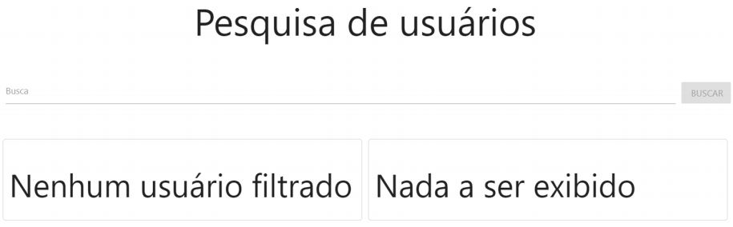
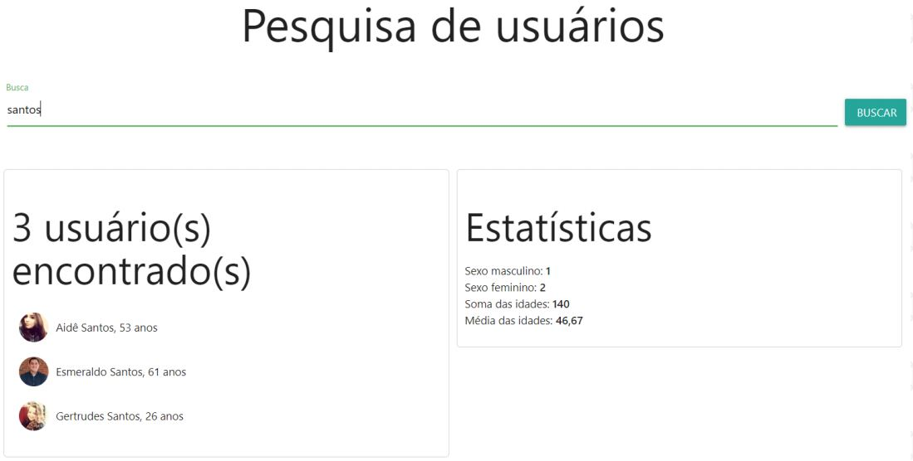

# Desafio do Módulo 01

## To Do list

- [x] Levantar o back-end com o [JSON Server](https://www.npmjs.com/package/json-server);
- [x] Criar o layout com o [Materialize](https://materializecss.com);
- [x] Capturar os eventos do `input`;
  - [x] Prevenir comportamento padrão de formulário;
- [x] Criar elementos dinamicamente;
- [x] Realizar requisições HTTP com `async`/`await`;
- [ ] Criar indicação de "loading" no momento da requisição HTTP;
- [ ] Filtrar usuários;

## Objetivos

Exercitar os seguintes conceitos trabalhados no Módulo:

- Declarar elementos HTML como títulos, input, div, span, ul, li etc.
- Estilizar o app com CSS.
- Mapear elementos do DOM para serem manipulados com JavaScript.
- Formatar valores com JavaScript.
- Realizar diversos cálculos com array methods como map, filter e reduce.
- Realizar requisições HTTP com o comando fetch.

## Enunciado

Criar uma aplicação para filtrar usuários e mostrar estatísticas a partir do filtro definido.

## Atividades

Os alunos deverão desempenhar as seguintes atividades:

1. "Subir" o backend de usuários que será fornecido pelo professor no **Fórum de Avisos**. Basta descompactar o arquivo e executar:

```bash
yarn install
# ou
npm install
```

Para instalar as dependências, execute:

```bash
yarn start
# ou
npm start
```

Para deixar o backend online. Este backend está configurado para "escutar" a porta [3001](http://localhost:3031).

2. Carregar os dados dos usuários em um array.
3. Permitir a filtragem de usuários através de um input com interação do usuário.
4. O usuário poderá filtrar dados quando digitar pelo menos um caractere no input.
5. O usuário poderá filtrar os dados tanto digitando "Enter" quanto clicando no botão correspondente, conforme imagens mais abaixo.
6. Montar dois painéis.
7. No painel da esquerda, listar os usuários filtrados.
8. No painel da direita, calcular e mostrar algumas estatísticas sobre esses usuários, conforme imagens abaixo.

**Tela inicial da aplicação (sugestão):**



**Tela após filtro "santos":**



## Dicas

1. Após executar a requisição à API, obtenha somente os dados necessários ao app. Esses são: `name` (first + " " + last), `picture` (imagem), `dob.age` (idade) e `gender` (sexo).
2. Monitore o input com o evento "keyup".
3. Filtre os dados a partir de qualquer posição no nome, ou seja, o nome "Brenda" (caso exista na API) deve ser retornado se o filtro for "enda".
4. Para filtrar, considere todo o texto em minúsculas. Assim, o filtro "E" trará tanto "Elena" quanto "Helena", caso existam na API. Utilize a função `Array.includes`.
5. **<u>Não faça a “limpeza” do texto, ou seja, devem ser considerados os acentos e caracteres especiais</u>. Portanto, o texto "Andre" <u>não pode filtrar</u> o nome “André”**.
6. Dê um `console.log()` nos dados do evento de digitação e você descobrirá como "cercar" a tecla "Enter".
7. Foque mais no código JavaScript e menos na interface. O mais importante é que o filtro e os cálculos estejam corretos.
8. Quebre o seu código em funções bem definidas.
9. Será necessária uma boa dose de manipulação manual do DOM. Isso pode ser feito tanto com `innerHTML` + `string` (recomendo a utilização de _template literals_) ou com os comandos `document.createElement`, `appendChild`, etc.
10. Se quiser fazer uma interface semelhante a das imagens, utilize o [Materialize](https://materializecss.com).
11. Não deixe de assistir o vídeo desse desafio, onde demonstro a aplicação em funcionamento e dou mais algumas dicas.
