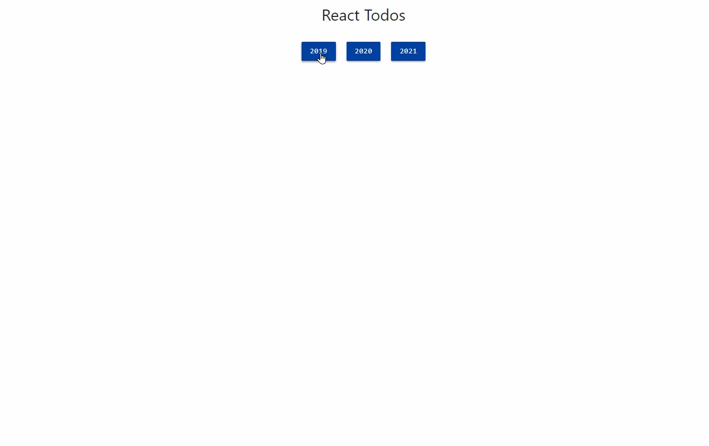

# Desafio do Módulo 03

## Objetivos

Exercitar os seguintes conceitos trabalhados no Módulo:

- [x] Implementação de algoritmos com JavaScript.
- [x] Criação de componentes com React.
- [x] Utilização de React Hooks.
- [x] Consumo de um Backend.

## Enunciado

Criar uma aplicação com React para visualizar tarefas cumpridas/não cumpridas baseando-se em ano/mês, com a possibilidade de cumprir/descumprir tarefas (opcional).

## Atividades

Os alunos deverão desempenhar as seguintes atividades:

1. Defina uma pasta base, como por exemplo, **react-todos**.
2. Na pasta base, crie o projeto com o pacote `create-react-app` ou utilize o projeto `\react-projeto-base`, já disponibilizado pelo professor no fórum do módulo. Esta última é a forma recomendada pelo professor, pois possui uma versão estável do React ([16.3.1](https://github.com/facebook/react/releases/tag/v16.3.1)). A versão 17.x mostrou estar instável nos meus testes, atualmente (dez/2020). Recomendo que a pasta se chame `frontend/`.
3. Converta o projeto base para utilizar Functional Components com Hooks.

4. Instale o backend fornecido pelo professor no **Fórum de Avisos**. O backend consiste no arquivo `backend.json`, servido pelo pacote [json-server](https://www.npmjs.com/package/json-server). Este arquivo será modificado pelo professor a cada oferta. **Portanto, as imagens contidas neste documento <u>não refletem necessariamente</u> o conteúdo do arquivo de vocês**. Para instalar, basta descompactar a pasta backend dentro da pasta base, acessá-la via terminal de comandos e executar `npm install` ou `yarn`. Assim, todas as dependências serão instaladas. Para executar o backend, digite o comando `npm start` ou `yarn start`. O backend será executado na porta 3001, e poderá ser acessado através de [localhost:3001/todos](http://localhost:3001/todos), conforme o exemplo abaixo:

```bash
json-server --watch backend.json --port 3001

\{^_^}/ hi!

Loading backend.json
Done

Resources
http://localhost:3001/todos

Home
http://localhost:3001

Type s + enter at any time to create a snapshot of the database
Watching...
```

5. Se tudo foi feito corretamente, o projeto deve estar organizado da seguinte forma:

```
react-todos/
├── backend/
└── frontend/
```

6. Estude o backend. Acesse [localhost:3001/todos](http://localhost:3001/todos) e verifique como os dados estão dispostos.

```json
[
  {
    "id": "002e2d59-fed7-4762-a074-322172b89336",
    "day": 26,
    "month": 6,
    "year": 2020,
    "period": "2020-06",
    "date": "2020-06-26",
    "description": "Pagar conta de luz",
    "done": true
  },
  {
    "id": "004134ca-6eda-435c-a1bc-ca0cf93caec8",
    "day": 15,
    "month": 6,
    "year": 2021,
    "period": "2021-06",
    "date": "2021-06-15",
    "description": "Descansar",
    "done": true
  }
  // Demais Objetos
]
```

7. A interface fica a critério do aluno. O foco da avaliação serão os cálculos e conceitos relacionados a React Hooks.

8. Implementação opcional (não será cobrada no questionário). Ao clicar em uma tarefa, cumpri-la ou descumpri-la, refletindo a ação tanto no backend quanto no frontend.

9. Segue um exemplo do Front End. Divida os dados em agrupamentos de anos e meses. Vou também disponibilizar um vídeo da aplicação sendo executada no formato `.gif` no Fórum de Avisos.

10. Exemplo filtrando os dados de Agosto/2020.

<p aling="center">
  
<p>

## Dicas

Algumas dicas com base na implementação feita pelo professor, que foi feita com a utilização de React Hooks:

1. A minha interface gráfica é baseada no [Materialize CSS](http://materializecss.com/).

2. Isole todo o comportamento de comunicação com o backend em um arquivo separado, como por exemplo, `./api/api.js`. Isso melhora a organização do seu código.

3. Este é o estado da minha aplicação (`React.useState`), concentrado em `App.js`:

<!-- prettier-ignore -->
  - a. `selectedYear`;
  - b. `selectedMonth`;
  - c. `selectedTodos`.

4. Utilizei React.useEffect para:

<!-- prettier-ignore -->
  - a. Monitorar `selectedYear` e `selectedMonth` para realizar o filtro das tarefas corretamente.

5. Utilize meses e anos fixos. Os anos das tarefas são **2019**, **2020** e **2021**.

6. Para filtrar tarefas por mês e ano, utilize a seguinte URL como exemplo, que filtra as tarefas de março/2020: [localhost:3001/todos?year=2020&month=3](http://localhost:3001/todos?year=2020&month=3)

7. Os componentes referentes aos botões de anos e meses podem ser reaproveitados, bastando modificar suas `props`.

8. Dividi minha aplicação nos seguintes componentes, dentro de `<App />`:

<!-- prettier-ignore -->
  - a. `<ButtonContainer />` e `<Button />` para os botões de anos e meses;
  - b. `<Summary />` para o sumário dos dados;
  - c. `<Todos />` e `<Todo />` para a listagem de tarefas.

9. Para o preenchimento do questionário, deixe o app aberto no seu estado inicial. Para garantir, instale novamente o backend fornecido pelo professor. Deixe aberto também o backend em [localhost:3001/todos](http://localhost:3001/todos). Preste muita atenção às perguntas, pois algumas possuem o **EXCETO**. "Pense fora da caixa". Utilize o navegador ao seu favor.

10. **Opcional**. Para implementar a mudança de status de cumprimento da tarefa (`done = true` para `done = false` e vice-versa), utilize a biblioteca axios e realize uma requisição do tipo `PUT` em [localhost:3001/todos/:id_da_tarefa](http://localhost:3001/todos/:id_da_tarefa). Envie no corpo requisição os mesmos dados da tarefa original, removendo o id e trocando apenas o valor de `done`. Utilize `axios.put` para isso.

## Iniciando

Dentro da pasta `desafio-03/backend/` e `desafio-03/frontend/` **instale as depências** de necessárias do package.json para esse projeto:

```bash
npm install
#or
yarn install
```

Inicie o projeto:

```bash
npm start
#or
yarn start
```

Espere os projeto serem compilados em suas respectivas portas pré-definidas.
