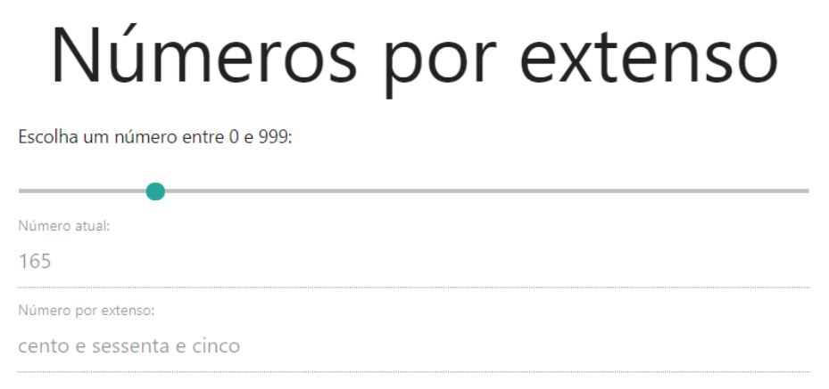

# Módulo 1 - Fundamentos

## Objetivos

Exercitar os seguintes conceitos trabalhados no Módulo:

- [x] Utilização de elementos HTML.
- [x] Utilização de identificadores em elementos HTML.
- [x] Captura de referência de elementos com JavaScript.
- [x] Manipulação de eventos com JavaScript.
- [x] Utilização de funções com JavaScript.

## Enunciado

Construa, utilizando HTML, CSS e JavaScript puro, uma aplicação para mostrar números por extenso.

## Atividades

Os alunos deverão desempenhar as seguintes atividades:

1. **Implementar**, através de **HTML**, **CSS** e **JavaScript puro**, uma aplicação que deve, a partir de um número definido pelo usuário (entre **0** e **999**, inclusive), mostrar como é a descrição do número, ou seja, o número por extenso.

2. A aplicação deve conter 3 inputs.
   a. O primeiro input deve ser do tipo range e permitir a mudança de valores entre 0 e 999 (inclusive).
   b. O segundo input deve ser textual, desabilitado e somente-leitura. Este input deve mostrar o número selecionado do range em formato numérico.
   c. O terceiro input deve ser textual, desabilitado e somente-leitura. Este input deve mostrar o número selecionado do range em formato por extenso.
3. A imagem abaixo ilustra uma possível interface para a aplicação.

## Dicas

- Utilize o método `load` de `window.addEventListener` para garantir que o DOM esteja totalmente carregado antes de qualquer instrução JavaScript. Como uma alternativa mais declarativa, pesquise e veja como utilizar o atributo `defer` na tag `<script>`.
- Utilize `id`'s nos inputs para mapeá-los no script com `document.querySelector`.
- Utilize o evento input para mapear a mudança de valores no input do tipo `range`.
- Crie funções para tratar números com 1, 2 e 3 caracteres. Faça reuso dessas funções.
- Não se preocupe tanto com a interface gráfica. O mais importante é o código estar funcionando. Se quiser implementar como na imagem acima, utilize o [Materialize CSS](https://materializecss.com/).
- **Saia da zona de conforto** e **pense fora caixa**!
