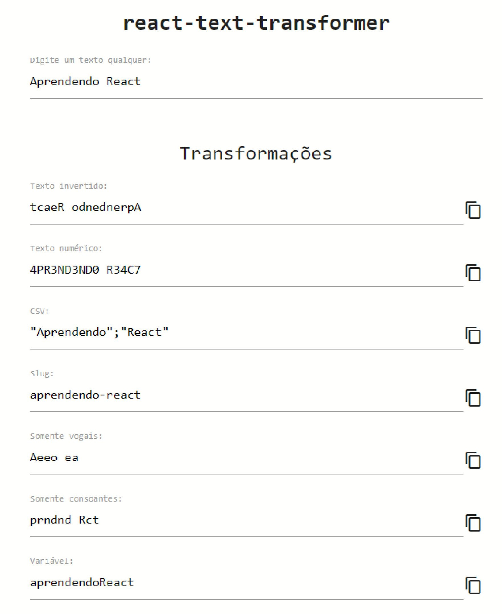

# Trabalho prático do Módulo 03

## Objetivos

Exercitar os seguintes conceitos trabalhados no Módulo:

- [x] Implementação de aplicações com JavaScript e React.
- [x] Criação de Class Components.
- [x] Utilização da API de Área de Transferência (opcional).

## Enunciado

Construa, utilizando React e **preferencialmente** Class Components, uma aplicação para realizar a transformação de textos, conforme regras abaixo

## Atividades

Os alunos deverão desempenhar as seguintes atividades:

- 1. **Implementar**, utilizando React e preferencialmente Class Components, uma aplicação denominada “**react-text-transformer**” que possuirá um `input` **editável** e diversos outros inputs **somente-leitura**, para exibir transformações a partir do texto informado pelo usuário. As transformações a serem realizadas são:

  - 1.1 Texto invertido.

  - 1.2. Texto numérico, com as seguintes regras:

    - a. Texto convertido para maiúsculas.
    - b. Texto com remoção de acentos (opcional).
    - c. Troca de O por 0 (zero).
    - d. Troca de L por 1.
    - e. Troca de E por 3.
    - f. Troca de A por 4.
    - g. Troca de S por 5.
    - h. Troca de T por 7.

  - 1.3. Texto no formato [CSV](https://rockcontent.com/br/blog/csv/), com as seguintes regras:

    - a. Cada palavra deve ser envolvida por **aspas duplas**.
    - b. As palavras devem ser separadas por **ponto-e-vírgula**.

  - 1.4. [Slug](https://rockcontent.com/br/blog/slug/), com as seguintes regras:

    - a. Texto em minúsculas.
    - b. Texto com remoção de acentos (opcional).
    - c. Cada palavra deve ser separada por hífen.

  - 1.5. Somente vogais, preservando os espaços em branco.

  - 1.6. Somente consoantes, preservando os espaços em branco.

  - 1.7. Formato de variável ([camelCase](https://pt.wikipedia.org/wiki/CamelCase)), com as seguintes regras.

    - a. Texto com remoção de acentos (opcional).
    - b. Primeira palavra totalmente em minúsculas.
    - c. Demais palavras em minúsculas com o primeiro caractere maiúsculo.

  - 2. **Implementar**, **<u>opcionalmente</u>**, uma funcionalidade que permite que o usuário copie o texto transformado para a Área de Transferência. Mais informações podem ser obtidas [aqui](https://www.w3schools.com/howto/howto_js_copy_clipboard.asp).

  - 3. A imagem abaixo ilustra um exemplo de implementação. Será também disponibilizado um vídeo no formato `.gif` no **Fórum de Avisos**.

  

# Dicas

- Utilize o projeto-base fornecido pelo professor, que contém uma versão estável do **React (16.3.1)**. Testei recentemente uma aplicação com o React 17.x e percebi algumas instabilidades, como por exemplo, um _refresh_ muito lento do servidor.

- A aplicação que implementei só possui um atributo no objeto de `this.state` em App.js => userInput.

- Para a interface, utilizei o [Materialize CSS](https://materializecss.com/). O projeto-base já possui esta integração. Lembre-se de que o foco é a implementação de JavaScript com React, e não a interface.

- Crie o componente `<Input />` e torne-o customizável. Na minha implementação, criei as props `readOnly` e `allowCopy`. Todos os inputs da imagem acima são instâncias do componente `<Input />` com variações nestas props.

- As implementações da remoção de acentos e da funcionalidade de cópia do texto são opcionais e, portanto, não serão cobradas no questionário.

- Utilizei muitos **arraymethods**, como `map()`, `filter()`, `split()`, `join()` e `reverse()`.

- "Faça o computador trabalhar para você". É possível criar um array de objetos que comporte todas as transformações, além de id e descrição. Assim, é possível iterar a criação dos componentes de forma dinâmica com `array.map`.

- Demonstrarei minha implementação na Aula Interativa 01.

## Respostas finais

- Os alunos deverão desenvolver a prática e, depois, responder às seguintes questões objetivas:
