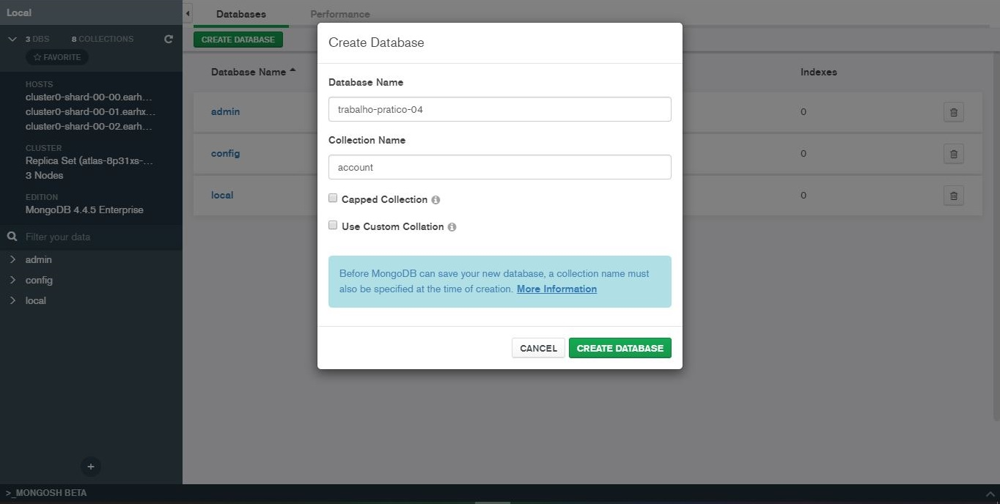

# Trabalho prático do Módulo 04

## Objetivos

Exercitar os seguintes conceitos trabalhados no Módulo:

- [x] Implementar uma API e integra-la ao MongoDB.
- [x] Persistência de Dados no MongoDB Atlas (_Daas_).
- [x] Estruturação e persistência dos dados pelo mongoose.

## Enunciado

O aluno deverá implementar uma API integrada ao MongoDB Atlas cujo o schema dos dados será definido pelo mongoose. Esta API terá alguns endpoints para manipulação dos dados.

## Atividades

O aluno deverá baixar o arquivo com os dados para a carga inicial na base de dados e desempenhar as seguintes atividades:

1. Criar um banco de dados no MongoDB Atlas, uma coleção e importar os dados do arquivo “`accounts.json`” em sua coleção. **Dica**: para importar, utilize o **MongoDB Compass** ou a ferramenta para importar por **linha de comando**:

2. Implementar um modelo (schema) para essa coleção, considerando que todos os campos são requeridos e o campo balance não pode ser menor que 0.

3. Criar o projeto **my-bank-api** para implementação dos endpoints.

4. Crie um endpoint para registrar um depósito em uma conta. Esse endpoint deverá receber como parâmetros a “agencia”, o número da conta e o valor do depósito. Ele deverá atualizar o “balance” da conta, incrementando-o com o valor recebido como parâmetro. O endpoint deverá validar se a conta informada existe, caso não exista deverá retornar um erro, caso exista retornar o saldo atual da conta.

5. Crie um endpoint para registrar um saque em uma conta. Esse endpoint deverá receber como parâmetros a “agência”, o número da conta e o valor do saque. Ele deverá atualizar o “balance” da conta, decrementando-o com o valor recebido com parâmetro e cobrando uma tarifa de saque de (1). O endpoint deverá validar se a conta informada existe, caso não exista deverá retornar um erro, caso exista retornar o saldo atual da conta. Também deverá validar se a conta possui saldo suficiente para aquele saque, se não tiver deverá retornar um erro, não permitindo assim que o saque fique negativo.

6. Crie um endpoint para consultar o saldo da conta. Esse endpoint deverá receber como parâmetro a “agência” e o número da conta, e deverá retornar seu “balance”. Caso a conta informada não exista, retornar um erro.

7. Crie um endpoint para excluir uma conta. Esse endpoint deverá receber como parâmetro a “agência” e o número da conta e retornar o número de contas ativas para esta agência.

8. Crie um endpoint para realizar transferências entre contas. Esse endpoint deverá receber como parâmetro o número da “conta” origem, o número da “conta” destino e o valor de transferência. Esse endpoint deve validar se as contas são da mesma agência para realizar a transferência, caso seja de agências distintas o valor de tarifa de transferência (8) deve ser debitado na conta origem. O endpoint deverá retornar o saldo da conta origem.

9. Crie um endpoint para consultar a média do saldo dos clientes de determinada agência. O endpoint deverá receber como parâmetro a “agência” e deverá retornar o balance médio da conta.

10. Crie um endpoint para consultar os clientes com o menor saldo em conta. O endpoint deverá receber como parâmetro um valor numérico para determinar a quantidade de clientes a serem listados, e o endpoint deverá retornar em ordem crescente pelo saldo a lista dos clientes (agência, conta, saldo).

11. Crie um endpoint para consultar os clientes mais ricos do banco. O endpoint deverá receber como parâmetro um valor numérico para determinar a quantidade de clientes a serem listados, e o endpoint deverá retornar em ordem decrescente pelo saldo, crescente pelo nome, a lista dos clientes (agência, conta, nome e saldo).

12. Crie um endpoint que irá transferir o cliente com maior saldo em conta de cada agência para a agência private agencia=99. O endpoint deverá retornar a lista dos clientes da agencia private.

## Iniciando

### Instalando dependências

Dentro da pasta `trabalho-pratico-04/` **instale as depências** de necessárias do [package.json](https://github.com/JefersonLucas/bootcamp-full-stack/blob/main/trabalho-pratico-04/package.json) para esse projeto:

```bash
npm install
#or
yarn install
```

Inicie o projeto:

```bash
npm start
#or
yarn start
```

### Conectando o MongoDB Atlas

Após **configurar conexão segura** no [MongoDB Atlas](https://www.mongodb.com/cloud/atlas), escolha um **método de conexão**.

1. Esconhendo um método de conexão.
   

**Obs**.: Escolhi por meio do [MongoDB Compass](https://downloads.mongodb.com/compass/mongodb-compass-1.26.1-win32-x64.exe).

2. Copie a **string de conexão** e abra o **MongoDB Compass**.
   

3. Com o MongoDB Compass aberto, **cole a string de conexão**.
   

4. Conexão com o MongoDB Compass concluída!
   

### Criando uma base de dados

No MongoDB Compass já configurado e conectado, escolha a opção **Create Database**.

- Criando uma base de dados.
  

### Importando dados do arquivo

1. Dentro da base de dados `trabalho-pratico-04` e na coleção `account`, importe os dados do arquivo “`accounts.json`” na coleção.
   
2. Aguarde a importação ser concluída.
   
